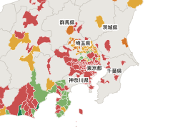

# PLATEAUカルテ

**3D都市モデル（Project PLATEAU）の建物属性が、自治体ごとに実際どれだけ入っているかを、306自治体すべてで実測した。**

公式の「属性情報公開リスト」は、仕様上その属性があるかの○×で、56都市・2021年更新が最後になっている。
実測すると両方向に食い違う。**公式で○の白河市は建築年が17.5%、公式で空欄の宗像市は78.5%**入っている。

カルテは、データを落として開く前に「この自治体でその分析を始められるか」に答える。

- ビューア：https://harutaro-bm.github.io/plateau-carte/
- ソースコード：https://github.com/Harutaro-BM/plateau-carte



## 全国の結果（2026-09-15 実測）

306/306自治体、標本 10,714,532棟、転送 15.8GB、約43分。

| 属性 | ◎＋○の自治体 |
|---|---:|
| 高さ種別 | 100.0% |
| 高さ | 99.0% |
| 測量年 | 87.3% |
| 用途 | 70.9% |
| 階数 | 58.5% |
| 構造種別 | 55.2% |
| 耐火構造 | 50.3% |
| **建築年** | **15.4%** |

始められる分析（必要な属性がそろっている自治体数）：
時系列比較 267／高さ解析 213／人口推定 174／**耐震・被害推定 86**。
4つすべて可能は44自治体、どれも不可は20自治体。

- **構造種別と耐火構造は、全306自治体で◎か×のどちらかしかない**（中間の段階が0件）。
  整備の仕様で「入れる／入れない」が決まっているということで、自治体を1つ見て全国を推し量ることはできない
- **建築年は県単位でまとまる。**東京都62自治体はすべて0%、隣の埼玉県は49自治体中35で入っている。
  90%以上入っているのは磐田市・焼津市の2市だけ（いずれも静岡県）

「始められる」は必要条件を満たすという意味で、分析結果の精度は保証しない。

## 測り方

- 各自治体の最新年度の CityGML（建物）を対象にする。zip の中央ディレクトリを HTTP レンジ要求で読み、必要なメッシュだけを取得する
- **標本は層化抽出。**メッシュを非圧縮サイズ順に並べて総バイト数で4層に等分し、各層から6メッシュ（最大24）を等間隔に選ぶ。
  乱数を使わないので、誰が走らせても同じメッシュが選ばれる
- 全数が分かっている12自治体（階数）で、標本の誤差は**平均0.6pt・最悪2.8pt**。
  以前の方式（サイズの大きい3メッシュ）は密集市街地に偏り、平均9.8pt・最悪66.7pt だった
- 値として入っているダミーを除外する：`measuredHeight=-9999`、`storeysAboveGround=9999`、`usage=461`（不明）、`surveyYear=0001`、建築年の1800以下・2100以上
- 出力は段階評価（◎90%以上／○60〜90%／△20〜60%／▲0〜20%／×0%）。
  最悪2.8ptの誤差があるので、小数で自治体の順位は付けない

詳細は [docs/00-spec.md](docs/00-spec.md)（仕様）と [docs/04-stratified-sampling.md](docs/04-stratified-sampling.md)（標本設計と検証）。

## 再現手順

```bash
python scripts/names.py       # 自治体コード → 日本語名（306件）
python scripts/scan.py        # 全国走査（約43分・転送約16GB）。途中保存があるので、中断しても再実行で続きから
python scripts/rebuild.py     # 地図の生成と web/ への配布
python -m http.server 3200 --directory web
```

- 走査とビューアは Python 3.12 の標準ライブラリだけで動く。ビューアは依存ライブラリなしの静的HTML
- 地図の生成（`build_map.py`）だけ DuckDB の空間拡張を使う（`pip install duckdb pandas`）。
  都道府県ごとの行政区域データを `data/n03/` に落とす（数百MB）
- 走査対象の一覧は `data/plateau_coverage.json`（走査時点の306自治体）を同梱している。
  `python scripts/fetch_coverage.py` で取り直すと、その後に追加された自治体も入るので結果は変わる

## 主なファイル

| パス | 内容 |
|---|---|
| `data/carte.json` | 自治体ごとの充填率・段階・始められる分析 |
| `data/carte_top3_2026-08-19.json` | 以前の方式（上位3メッシュ）の結果。比較用 |
| `data/grade_diff.json` | 以前の方式との段階の差（2,448判定中、下方142・上方23） |
| `web/` | ビューア（`index.html`・`carte.json`・`names.json`・地図SVG） |
| `scripts/scan.py` | 全国走査 |

## ライセンスと出典

- コード：MIT（[LICENSE](LICENSE)）
- 走査結果（`data/*.json`）：CC BY 4.0
  - 出典：「3D都市モデル（Project PLATEAU）」（国土交通省）を加工して作成
  - 自治体名：G空間情報センター（運営：一般社団法人 社会基盤情報流通推進協議会）のデータセット一覧（CKAN API）から作成
- 地図の境界：「国土数値情報（行政区域データ）」（国土交通省）を加工して作成。国土数値情報の利用約款に従う

**ここに示す充填率は作成者が実測した値であり、国土交通省が公表した値ではない。**
